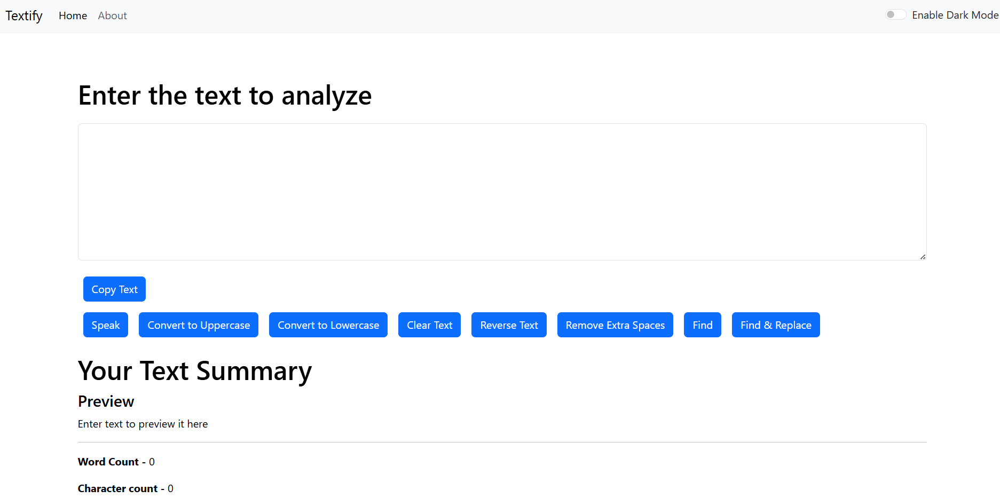

# Textify - Text Analyzer

**Textify** is a simple and efficient text analysis tool built with React. It provides various text manipulation features like converting text to uppercase/lowercase, counting words and characters, finding and replacing words, removing extra spaces, and even text-to-speech functionality.

---

## 🌐 Live Demo
[**Textify App**](https://textify-app-with-reactrouter.onrender.com)- Try it out!

---

## 🚀 Features

- 🔤 **Convert to Uppercase & Lowercase**
- 🔁 **Reverse Text**
- 📋 **Copy to Clipboard**
- 🔊 **Text-to-Speech**
- 🕵️‍♂️ **Find and Replace Words**
- ✂️ **Remove Extra Spaces**
- 📝 **Text Summary (Word count, Character count, Reading time, etc.)**

---

## 📷 Screenshots



---

## 🛠 Tech Stack

- **Frontend:** React, Bootstrap
- **Deployment:** Render

---

## 🏗 Installation & Setup

### 🔹 Clone the Repository
```bash
git clone https://github.com/Bhavana-Mallineni/Textify-App.git
cd Textify-App
```

### 🔹 Install Dependencies
```bash
npm install
```

### 🔹 Run the App Locally
```bash
npm start
```

Open [http://localhost:3000](http://localhost:3000) to view it in the browser.

---

## 🚀 Deployment

The app is deployed on **Render**.

### **Render Build Settings:**
- **Build Command:** `npm run build`
- **Start Command:** `npm start`

To deploy:
1. Push the latest code to GitHub.
2. Connect the repo with Render.
3. Set the correct **Build Command** and **Start Command**.
4. Deploy & Enjoy! 🎉

---

## 💡 Usage

1. Enter text into the text box.
2. Click on the available buttons to perform various actions.
3. View text statistics like word count, character count, vowel/consonant count, etc.
4. Use **Find & Replace** to modify text easily.
5. Copy text or use **Text-to-Speech** for listening.

---

## 🤝 Contributing
Feel free to contribute by **forking** the repo, making changes, and submitting a **pull request**.

---

## 📜 License
This project is licensed under the **MIT License**.

---

### ⭐ If you like this project, don't forget to **star** the repository! ⭐

